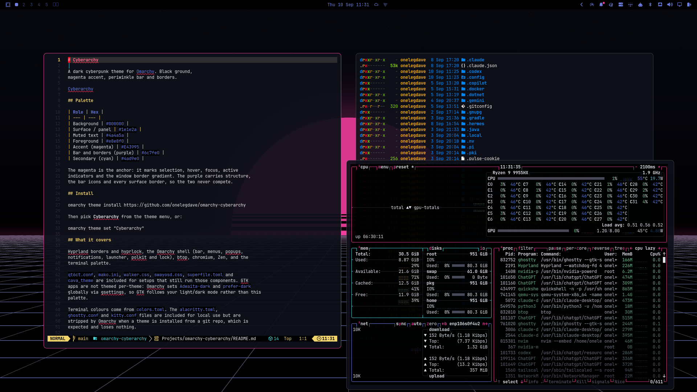

# Cyberarchy

A dark cyberpunk theme for [Omarchy](https://omarchy.org). Black ground,
magenta accent, periwinkle bar and borders.



## Palette

| Role | Hex |
| --- | --- |
| Background | `#000000` |
| Surface / panel | `#1e1e2a` |
| Muted text | `#4a4a5a` |
| Foreground | `#e8e8f0` |
| Accent (magenta) | `#E43995` |
| Bar and borders (purple) | `#6c7fe0` |
| Secondary (cyan) | `#4ad9e0` |

The magenta is the anchor: it marks selection, hover, focus, active
indicators and the window border gradient. The purple carries structure,
the bar icons and every surface border, so the two never compete.

## Install

```
omarchy theme install https://github.com/onelegdave/omarchy-cyberarchy
```

Then pick **Cyberarchy** from the theme menu, or:

```
omarchy theme set "Cyberarchy"
```

## What it covers

Hyprland borders and hyprlock, the Omarchy shell (bar, menus, popups,
notifications, launcher, polkit and lock), btop, chromium, Zen, and the
terminal palette.

`qt6ct.conf`, `mako.ini`, `walker.css`, `swayosd.css`, `superfile.toml` and
`cava_theme` are included for setups that still run those components. GTK
apps are not themed per-theme: Omarchy sets `Adwaita-dark` and `prefer-dark`
globally via gsettings, so GTK follows your light/dark mode rather than this
palette.

Terminal colours come from `colors.toml`. The `alacritty.toml`,
`ghostty.conf` and `kitty.conf` files are included for local use but are
stripped by Omarchy when a theme is installed from a git repo, which is
expected and loses nothing.

### Shell section overrides

Rather than shipping a whole `shell.toml`, this theme ships three section
overrides so it keeps inheriting upstream template improvements:

- `shell.bar.toml` sets the bar's idle icon colour and the attention colour
  used by recording, muted mic, do-not-disturb and pending updates.
- `shell.hyprland.toml` sets the two shared border tokens, which every
  surface references.
- `shell.controls.toml` sets the normal, hover, focus and selected states.

## Wallpapers

Two are included, both generated from the palette above:

- `cyberarchy-1-4k@.jpg` - synthwave sun over a perspective grid.
- `cyberarchy-2-4k@.jpg` - rain-soaked skyline with neon crowns.

Drop your own into `~/.config/omarchy/backgrounds/cyberarchy/` to override
them without touching the theme.

## Optional extras

These are **not** part of the theme. Omarchy themes carry colour files, not
QML, so the following need edits to cloned plugins. Each survives theme
switches and needs redoing after a plugin re-clone.

### Magenta calendar hero

```
omarchy-plugin-clone omarchy.clock
```

In `~/.config/omarchy/plugins/<user>.clock/Panel.qml`, the hero date and its
glyph use `root.contentForeground`. Change both to `Color.accent`:

```qml
color: heroMouse.containsMouse
  ? Qt.lighter(Color.accent, 1.25)
  : Color.accent
```

For the ring around today, replace

```qml
border.color: Style.normalBorderFor(root.contentForeground, Color.accent)
```

with `border.color: Color.accent`.

### Magenta weather hero

```
omarchy-plugin-clone omarchy.weather
```

In `<user>.weather/Panel.qml`, set `color: Color.accent` on the condition
glyph (`id: heroIcon`), the temperature (`id: tempBig`), its unit, and the
map-marker and location lines if you want those too.

> The map-marker glyph is a Nerd Font private-use character. Edit that colour
> line in place rather than retyping the glyph line, or the icon is lost.

### Magenta active indicators

`Ui/BarIndicator.qml` sets `useActiveColor: false`, so indicators signal
active state by opacity alone and never pick up `bar.active`. To colour them:

```
omarchy-plugin-clone omarchy.indicators
```

Then add `useActiveColor: true` to each file in
`~/.config/omarchy/plugins/<user>.indicators/indicators/`.

### If you clone the widget your bar is anchored to

`omarchy-plugin-clone` rewrites the widget's layout entry to the new plugin
id but leaves `bar.centerAnchor` in `~/.config/omarchy/shell.json` pointing at
the original. The anchor then matches nothing and the bar falls back to plain
centring, so the anchored widget drifts instead of holding position. Point
`centerAnchor` at the cloned id to fix it.

### A note on cloned plugins

Cloning forks a plugin, so upstream fixes no longer reach it. That matters
more for the weather plugin, which talks to an external API, than for the
clock.

Apply changes with `omarchy-restart-shell`, not `omarchy theme set`.

## Credits

Wallpapers generated from the theme palette. Everything here is original.

## License

MIT. See [LICENSE](LICENSE).
